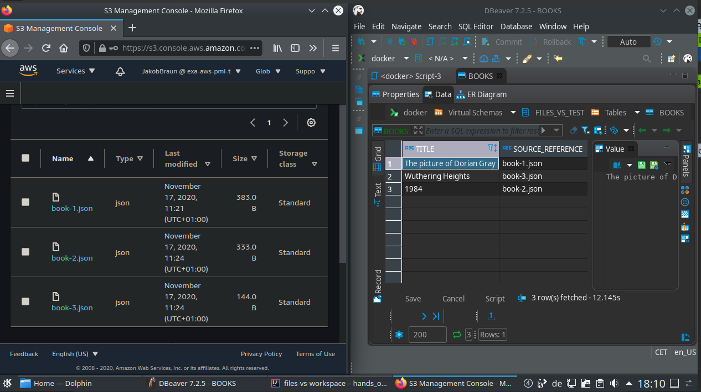
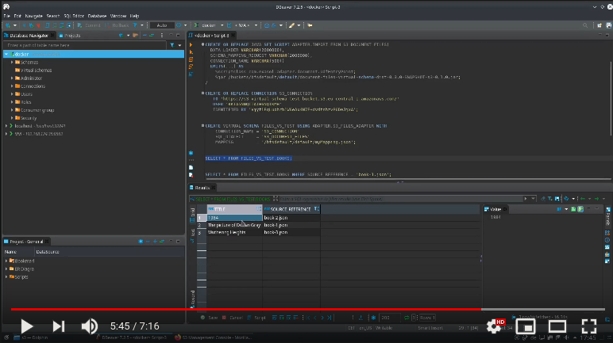
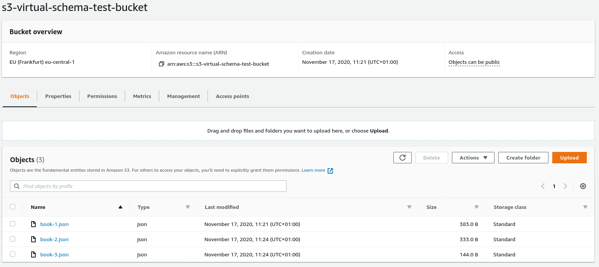
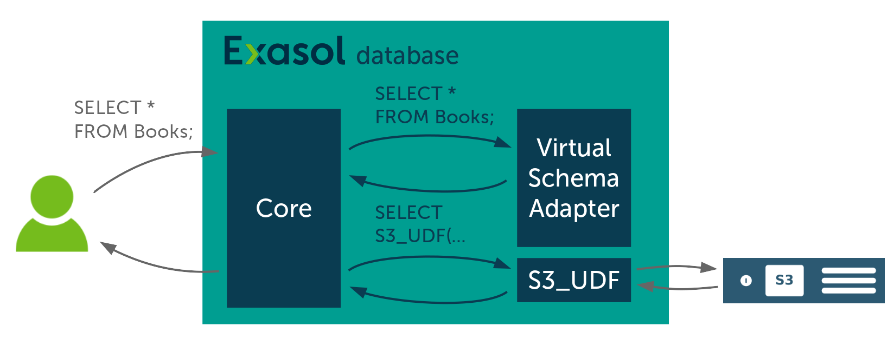
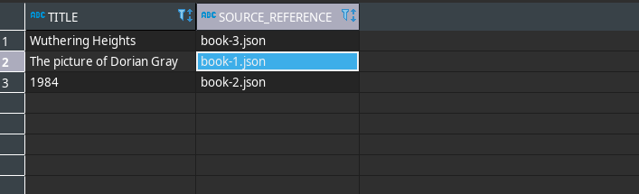
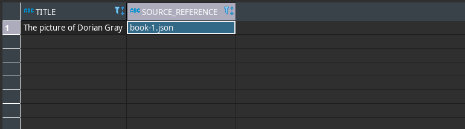

# Hands-on S3-Virtual-Schema



## Introduction

In this guide, we will walk through the setup of the Virtual Schema for document files stored on [AWS S3](https://aws.amazon.com/s3/). As an example we will create a virtual-schema for some JSON files.

There is also a dedicated [tutorial for parquet files](./hands_on_parquet.md).

You need:

* An Exasol database
* An AWS account

## Video

There also is a video version of this tutorial:

[](https://www.youtube.com/watch?v=eP3MuGw0Yx8)

## What is This for?

In this tutorial, we will create a virtual schema for JSON-documents that we store in an S3 Bucket. If you've never heard of S3, that is not a problem. You can imagine it as a very basic file storage. You can store files and access them using a key.

We are going to create a Virtual Schema for these files so that you can access the JSON data just like a regular Exasol table.

So you may ask yourself "Why not just create an Exasol table and import the data?". While in some cases this might even be the better solution, but there are also use cases where you still want to create a Virtual Schema:

### Using S3 as Cold-Storage

The first use case is that you have lots of data that you don't need very often in your analytics. In that case, you can use S3 as a cheap cold storage and integrate the data only when you needed them into your analytics. In case you can identify the data you need by the file name, you can use a filter on the file name, and the Virtual Schema adapter will only transfer the single file.

### Using this Virtual Schema for Importing

Also, if you decide to simply import your data into an Exasol table, you still have to import it. For that you can also use this Virtual Schema. For document data, this is not as easy as it sounds, since you need to convert the semi-structured JSON data into an Exasol table structure. This Virtual Schema allows you to do this mapping conveniently using the [Exasol Document Mapping Language (EDML)][edml-guide]. So in that case you, create the Virtual Schema, adapt the mapping until you're happy with it, and then simply copy the tables using an `IMPORT` command.

## Getting Started

So now, let's get started with the setup. First, we need to create an S3 bucket and upload some [example files](./books). You can do that by hand using the AWS Management Console or if you like automating things just like me use my [terraform setup](terraform_setup.md).

No matter which way you chose now you should be able to see your bucket in the AWS Console:


## The S3 Virtual Schema Adapter

Next we will install the S3 Virtual Schema adapter. It consists of two components:

* An adapter script
* An UDF script

### Why that?

*(Simply skip this section if you don't want to know it)*
Internally the Exasol database sends the query on a table of the Virtual Schema to the Virtual Schema adapter. What the Virtual Schema adapter does is rewriting the query into a different SQL-Statement. The JDBC Virtual Schema adapters rewrite the query into an SQL statement with an IMPORT statement that then does the actual data loading.

For the document Virtual Schemas, and by that also the S3 Virtual Schema, this is not possible, since the importer cannot import document data. For that reason, these Virtual Schemas define a UDF function that takes care of the data loading.


### Installation

To install the Virtual Schema adapter, download its latest jar from the [releases](https://github.com/exasol/s3-document-files-virtual-schema/releases) and upload to BucketFS:

``` shell script
curl -I -X PUT -T document-files-virtual-schema-dist-8.0.3-s3-3.0.6.jar http://w:writepw@<YOUR_DB_IP>:2580/default/
```

(If you have never used BucketFS, you can check out [its documentation](https://docs.exasol.com/database_concepts/bucketfs/bucketfs.htm))

Now, create a schema for the adapter script and the UDF:

```sql
CREATE SCHEMA ADAPTER;

--/
CREATE OR REPLACE JAVA ADAPTER SCRIPT ADAPTER.S3_FILES_ADAPTER AS
    %scriptclass com.exasol.adapter.RequestDispatcher;
    %jar /buckets/bfsdefault/default/document-files-virtual-schema-dist-8.0.3-s3-3.0.6.jar;
/

--/
CREATE OR REPLACE JAVA SET SCRIPT ADAPTER.IMPORT_FROM_S3_DOCUMENT_FILES(
  DATA_LOADER VARCHAR(2000000),
  SCHEMA_MAPPING_REQUEST VARCHAR(2000000),
  CONNECTION_NAME VARCHAR(500))
  EMITS(...) AS
    %scriptclass com.exasol.adapter.document.UdfEntryPoint;
    %jar /buckets/bfsdefault/default/document-files-virtual-schema-dist-8.0.3-s3-3.0.6.jar;
/
```

(If you should experience problems check our [troubleshooting section on the virtual schemas page](https://docs.exasol.com/database_concepts/virtual_schema/user_guide.htm))

## Creating the Connection

The virtual schema needs to connect to your AWS bucket. For that it needs an AWS-access key.
**Caution**: Don't mix this up with your AWS credentials. While the credentials are the username and password you use for login at the AWS Console, the access key is dedicated to machine login. You can use the AWS Console to [create an access-key pair](https://docs.aws.amazon.com/IAM/latest/UserGuide/id_credentials_access-keys.html#Using_CreateAccessKey).

Now you need to store this access key-pair in your Exasol database so that the Virtual Schema can use it. For that we use a `CONNECTION` definition, that stores your keys securely.

  ```
CREATE CONNECTION S3_CONNECTION
    TO ''
    USER ''
    IDENTIFIED BY '{
        "awsAccessKeyId": "<AWS ACCESS KEY ID>", 
        "awsSecretAccessKey": "<AWS SECRET KEY>", 
        "awsRegion": "<AWS REGION>", 
        "s3Bucket": "<S3 BUCKET NAME>" 
    }';
```

For details see the [user-guide](../user_guide/user_guide.md#creating-a-connection).

## Creating a Mapping Definition

Now we are going to create a [EDML definition][edml-guide] that maps the JSON data to an Exasol table structure. We will start simple and only map the title of each book:

```json
{
  "$schema": "https://schemas.exasol.com/edml-1.2.0.json",
  "source": "book-*.json",
  "destinationTable": "BOOKS",
  "addSourceReferenceColumn": true,
  "mapping": {
    "fields": {
      "Title": {
        "toVarcharMapping": {
        }
      }
    }
  }
}
``` 

Note that we used the wildcard `book-*.json` as `source`. This matches for example `book-1.json`.

Save this mapping as a file (for example `myMapping.json`) and upload it to BucketFS:

``` shell script
curl -I -X PUT -T myMapping.json http://w:writepw@<YOUR_DB_IP>:2580/default/
```

## Creating the Virtual Schema

Now we can create the Virtual Schema:

```sql
CREATE VIRTUAL SCHEMA FILES_VS_TEST USING ADAPTER.S3_FILES_ADAPTER WITH
    CONNECTION_NAME = 'S3_CONNECTION'
    MAPPING         = '/bfsdefault/default/myMapping.json';
```

## First Query

It's time to run our first query!
So let's get the title of all our books by running:

```sql
SELECT * FROM FILES_VS_TEST.BOOKS;
```



## Filtering

Now let's filter on the title:

```sql
SELECT * FROM FILES_VS_TEST.BOOKS WHERE SOURCE_REFERENCE = 'book-1.json';
```



While you might have expected this result, the cool thing about it is, that the adapter did only fetch this book. This is, however only the case for `WHERE` conditions on the `SOURCE_REFERENCE` column, since S3 is not a database and hence cannot filter the files by their content.

## What's next

So now you know everything for creating your first S3 Virtual Schema. To learn how to create more complex mappings than this one with only one column, check out the [EDML documentation][edml-guide].


[edml-guide]: https://github.com/exasol/virtual-schema-common-document/blob/main/doc/user_guide/edml_user_guide.md
