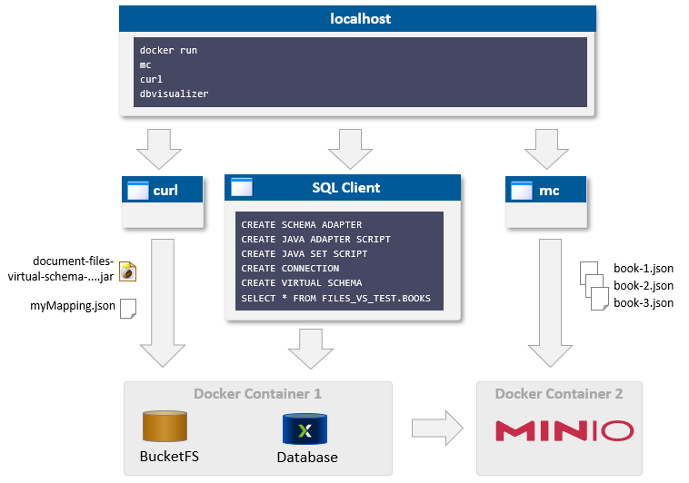

# Hands-on S3-Virtual-Schema With MinIO

## Introduction

VSS3 supports using three different variants of S3 buckets
* Real S3 buckets in the AWS cloud
* S3 buckets provided by [Localstack](https://github.com/localstack/localstack) Docker Container
* S3 buckets as emulated by [MinIO](https://min.io)'s S3-compatible interface

The current Hands-On Guide describes how to access S3 buckets emulated by a MinIO Docker Container, see also [MinIO documentation](https://github.com/minio/minio/tree/master/docs/docker?rgh-link-date=2023-07-25T06:41:28Z).

## Concepts

### Architectural Overview



### Credentials

Select a user name and a password for the MinIO Docker Container. Throughout this Hands On Guide these strings will be named as specified in column *Reference*:

| MinIO Terminology                    | AWS terminology       | Reference |
|--------------------------------------|-----------------------|-----------|
| User name for MinIO Docker Container | `<AWS ACCESS KEY ID>` | `$MUSER`  |
| Password for MinIO Docker Container  | `<AWS SECRET KEY>`    | `$MPASS`  |

### Variables

In the following this Hand-On Guide will use variables for the Host running the MinIO server name and the name of sample S3 bucket:

```shell
export MHOST=localhost
export MUSER=user
export MPASS=password
export MBUCKET=my-bucket
```

## Prerequisites and installation

* Docker Server and Client
* Minio Docker Container
* Minio Client
* Exasol Docker Container

<!--
* [Sample Json Files from VSS3](./books)
* Mapping Definitions for mapping json keys to SQL columns
See [Hands-on S3-Virtual-Schema](hands_on.md).
-->


## Setup MinIO Docker Container and Client

### Download MinIO Docker Image and run it as Docker Container

```shell
docker run --detach --name minio \
  -p 9000:9000 \
  -p 9001:9001 \
  -e "MINIO_ROOT_USER=$MUSER" \
  -e "MINIO_ROOT_PASSWORD=$MPASS" \
  -it minio/minio:RELEASE.2023-07-21T21-12-44Z.fips \
  server /data --console-address ":9001"
```

With the following command you can verify the container is running:

```shell
docker ps
```

In the output of `docker ps` you can also see the ports forwarded to your localhost:

```shell
26a6f597ea85  minio/minio:...fips  0.0.0.0:9000-9001->9000-9001/tcp  minio
```

### Setup MinIO Client `mc`

For adding content to MinIO you can use the MinIO client `mc`.
Its [manual](https://min.io/docs/minio/linux/reference/minio-mc.html#quickstart) also contains links to download a binary for various platforms.

The following following comand defines alias `myminio` for your MinIO server using the [selected credentials](#credentials):

```shell
mc alias set myminio http://$MHOST:9000/ $MUSER $MPASS
```

### Emulate an S3 Bucket With Sample Files

Next we will tell MinIO to emulate a sample S3 bucket:

```shell
mc mb myminio/$MBUCKET
```

Download the [sample Json files](./books) and upload them to the emulated S3 bucket:

```shell
mc cp book-1.json myminio/$MBUCKET/
mc cp book-2.json myminio/$MBUCKET/
mc cp book-3.json myminio/$MBUCKET/
```

## Setting up the Exasol Database

### Initial Setup

Run Exasol database, e.g. as [Docker-DB](https://hub.docker.com/r/exasol/docker-db/tags) in a Docker Container and follow the instructions in the following sections of document [Hands-on S3-Virtual-Schema](hands_on.md) to execute the required SQL statements:

* Section [ Installation](hands_on.md#installation)
  * Download S3VS latest jar and upload it to BucketFS
  * Create Java Adapter Script
  * Create Java Set Script
* Section [Creating a Mapping Definition](hands_on.md#creating-a-mapping-definition) to create a mapping definition and upload it to BucketFS.

### Creating the Connection to MinIO

In section [Emulate an S3 Bucket With Sample Files](#emulate-an-s3-bucket-with-sample-files) we configured MinIO to emulate a sample S3 bucket.

The following SQL statement will create a connection to this bucket:

```sql
CREATE OR REPLACE CONNECTION S3_CONNECTION
  TO '' USER ''
  IDENTIFIED BY '{
      "awsAccessKeyId": "$MUSER",
      "awsSecretAccessKey": "$MPASS",
      "awsRegion": "any-region",
      "s3Bucket": "$MBUCKET",
      "awsEndpointOverride": "$MHOST:9000",
      "useSsl": false
  }';
```

Please note:
* Your SQL client (e.g. [DbVisualizer](https://confluence.dbvis.com)) may not be able to resolve shell variables `$MUSER`, `MPASS`, `$MHOST`, `$MBUCKET`.
* So please replace these variables by the actual values described in section [Variables](#variables).

### Create a Virtual Schema and Run Your First Query

Follow additional instructions in document *Hands-on S3-Virtual-Schema*:
* [Creating the Virtual Schema](#creating-the-virtual-schema)
* [First Query](hands_on.md#first-query) to execute your first query and watch the results in your SQL client.
