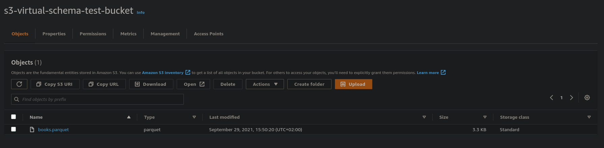
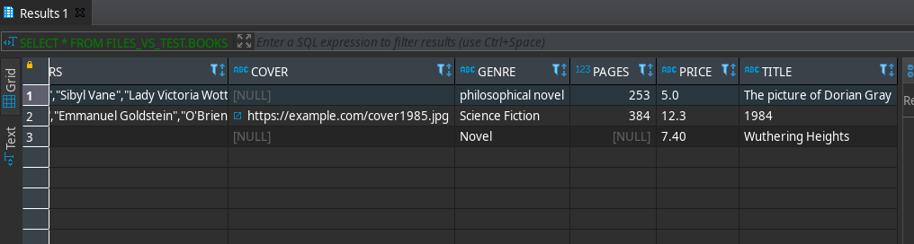

# Hands-on S3-Virtual-Schema With Parquet Files

## Introduction

In this guide, we will walk through the setup of the Virtual Schema for document files stored on [AWS S3](https://aws.amazon.com/s3/). As an example, we will create a virtual-schema for a parquet file.

There is also a different [tutorial using JSON files](./hands_on.md).

You need:

* An Exasol database
* An AWS account

## What is This for?

In this tutorial, we will create a virtual schema for Parquet files stored in an S3 Bucket. If you've never heard of S3, that is not a problem. You can imagine it as a very basic file storage. You can store files and access them using a key.

We are going to create a Virtual Schema for these files so that you can access them just like a regular Exasol table.

The example file we use in this tutorial has the same content as the three JSON files in the [books/](./books) folder. To get a first impression you can take a look at them instead of the parquet file itself since for the parquet file you need a viewer.

## Getting Started

So now, let's get started with the setup. First, we need to create a S3 bucket and upload an [example parquet file](./books/books.parquet). You can do that by hand using the AWS Management Console or if you like automating things just like me use my [terraform setup](terraform_setup.md).

No matter which way you chose now you should be able to see your bucket in the AWS Console:



## The S3 Virtual Schema Adapter

Next we will install the S3 Virtual Schema adapter. It consists of two components:

* An adapter script
* An UDF script

### Why that?

*(Simply skip this section if you don't want to know it)*
Internally the Exasol database sends the query on a table of the Virtual Schema to the Virtual Schema adapter. What the Virtual Schema adapter does is rewriting the query into a different SQL-Statement. The JDBC Virtual Schema adapters rewrite the query into an SQL statement with an IMPORT statement that then does the actual data loading.

For the document Virtual Schemas, and by that also the S3 Virtual Schema, this is not possible, since the importer cannot import document data. For that reason, these Virtual Schemas define a UDF function that takes care of the data loading.


### Installation

To install the Virtual Schema adapter, download its latest jar from the [releases](https://github.com/exasol/s3-document-files-virtual-schema/releases) and upload to BucketFS:

``` shell script
curl -I -X PUT -T document-files-virtual-schema-dist-7.3.7-s3-2.8.4.jar http://w:writepw@<YOUR_DB_IP>:2580/default/
```

(If you have never used BucketFS, you can check out [its documentation](https://docs.exasol.com/database_concepts/bucketfs/bucketfs.htm))

Now, create a schema for the adapter script and the UDF:

```sql
CREATE SCHEMA ADAPTER;

CREATE OR REPLACE JAVA ADAPTER SCRIPT ADAPTER.S3_FILES_ADAPTER AS
    %scriptclass com.exasol.adapter.RequestDispatcher;
    %jar /buckets/bfsdefault/default/document-files-virtual-schema-dist-7.3.7-s3-2.8.4.jar;
/

CREATE OR REPLACE JAVA SET SCRIPT ADAPTER.IMPORT_FROM_S3_DOCUMENT_FILES(
  DATA_LOADER VARCHAR(2000000),
  SCHEMA_MAPPING_REQUEST VARCHAR(2000000),
  CONNECTION_NAME VARCHAR(500))
  EMITS(...) AS
    %scriptclass com.exasol.adapter.document.UdfEntryPoint;
    %jar /buckets/bfsdefault/default/document-files-virtual-schema-dist-7.3.7-s3-2.8.4.jar;
/
```

(If you should experience problems check our [troubleshooting section on the virtual schemas page](https://docs.exasol.com/database_concepts/virtual_schema/user_guide.htm))

## Creating the Connection

The virtual schema needs to connect to your AWS bucket. For that it needs an AWS-access key.
**Caution**: Don't mix this up with your AWS credentials. While the credentials are the username and password you use for login at the AWS Console, the access key is dedicated to machine login. You can use the AWS Console to [create an access-key pair](https://docs.aws.amazon.com/IAM/latest/UserGuide/id_credentials_access-keys.html#Using_CreateAccessKey).

Now you need to store this access key-pair in your Exasol database so that the Virtual Schema can use it. For that we use a `CONNECTION` definition, that stores your keys securely.

 ```
CREATE CONNECTION S3_CONNECTION
    TO ''
    USER ''
    IDENTIFIED BY '{
        "awsAccessKeyId": "<AWS ACCESS KEY ID>", 
        "awsSecretAccessKey": "<AWS SECRET KEY ID>", 
        "awsRegion": "<AWS REGION>", 
        "s3Bucket": "<S3 BUCKET NAME>" 
    }';
``` 

For details see the [user-guide](../user_guide/user_guide.md#creating-a-connection).

## Creating a Mapping Definition

Now we are going to create a [EDML definition][edml-guide] that maps the parquet data to an Exasol table structure. Usually you do this by hand. However, for parquet files we have the [parquet-edml-generator](https://github.com/exasol/parquet-edml-generator/) in place that suggests a mapping definition based on the parquet-schema.

So download this tool from the [GitHub releases](https://github.com/exasol/parquet-edml-generator/releases).

Now you can run it locally on the command line:

```shell
java -jar parquet-edml-generator.jar books.parquet > mapping.json
```

Please note that you need to have our example file (`books.parquet`) in the same directory.

The generator creates the following mapping:

```json
{
  "source": "books.parquet",
  "destinationTable": "BOOKS",
  "description": "This mapping definition was auto-generated by the parquet-edml-generator.",
  "addSourceReferenceColumn": false,
  "mapping": {
    "fields": {
      "Authors": {
        "toJsonMapping": {
          "destinationName": "AUTHORS",
          "key": "none",
          "required": false,
          "varcharColumnSize": 2000000,
          "overflowBehaviour": "ABORT"
        }
      },
      "Characters": {
        "toJsonMapping": {
          "destinationName": "CHARACTERS",
          "key": "none",
          "required": false,
          "varcharColumnSize": 2000000,
          "overflowBehaviour": "ABORT"
        }
      },
      "Cover": {
        "toVarcharMapping": {
          "destinationName": "COVER",
          "key": "none",
          "required": false,
          "varcharColumnSize": 2000000,
          "nonStringBehaviour": "CONVERT_OR_ABORT",
          "overflowBehaviour": "TRUNCATE"
        }
      },
      "Genre": {
        "toVarcharMapping": {
          "destinationName": "GENRE",
          "key": "none",
          "required": false,
          "varcharColumnSize": 2000000,
          "nonStringBehaviour": "CONVERT_OR_ABORT",
          "overflowBehaviour": "TRUNCATE"
        }
      },
      "Pages": {
        "toDecimalMapping": {
          "destinationName": "PAGES",
          "key": "none",
          "required": false,
          "overflowBehaviour": "ABORT",
          "notNumericBehaviour": "ABORT",
          "decimalPrecision": 20,
          "decimalScale": 0
        }
      },
      "Price": {
        "toVarcharMapping": {
          "destinationName": "PRICE",
          "key": "none",
          "required": false,
          "varcharColumnSize": 2000000,
          "nonStringBehaviour": "CONVERT_OR_ABORT",
          "overflowBehaviour": "TRUNCATE"
        }
      },
      "Title": {
        "toVarcharMapping": {
          "destinationName": "TITLE",
          "key": "none",
          "required": false,
          "varcharColumnSize": 2000000,
          "nonStringBehaviour": "CONVERT_OR_ABORT",
          "overflowBehaviour": "TRUNCATE"
        }
      }
    }
  },
  "$schema": "https://schemas.exasol.com/edml-1.3.0.json"
}
```

The generator writes the mapping without formatting. For easier viewing and editing use an editor / IDE with good JSON support and format the file. Good editors also help with editing because they can give you code completion based on the JSON schema.

## Improving the Mapping

You can edit this mapping to fine-tune how the virtual schema maps the data. For example, you can change the varchar column sizes, if you know that your data has a certain max-size (2,000,000 is the Exasol limit). For details on the EDML mapping language check the [edml user-guide][edml-guide].

One thing that you should always check in the generated file is the `source` property. This property must point to the source file(s) in your S3 bucket. So if you just uploaded the `books.parquet` file to the bucket, the generated value is ok. If you renamed it or moved it to a subfolder you need to change the name in the mapping definition.

You also need to change it here if your parquet data is split into parts. In that case change the source to something like `books_part_*.parquet`.

You can also modify the order of the columns by simply reordering the mapping definitions in the mapping file.

Now upload this mapping to BucketFS:

``` shell script
curl -I -X PUT -T mapping.json http://w:writepw@<YOUR_DB_IP>:2580/default/
```

## Creating the Virtual Schema

Now we can create the Virtual Schema:

```sql
CREATE VIRTUAL SCHEMA FILES_VS_TEST USING ADAPTER.S3_FILES_ADAPTER WITH
    CONNECTION_NAME = 'S3_CONNECTION'
    MAPPING         = '/bfsdefault/default/mapping.json';
```

## First Query

It's time to run our first query!
So let's get the title of all our books by running:

```sql
SELECT * FROM FILES_VS_TEST.BOOKS;
```



## What's next

So now you know everything for creating your first S3 Virtual Schema. If you want to do more advanced mappings, check out the [EDML documentation][edml-guide]. For example, you could change the mapping so that the nested list authors are no longer mapped to a column with JSON string but to a separate table.


[edml-guide]: https://github.com/exasol/virtual-schema-common-document/blob/main/doc/user_guide/edml_user_guide.md
